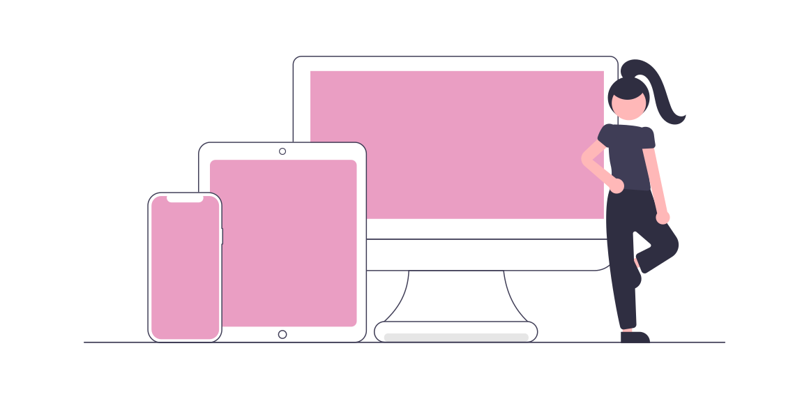

<h1 align="center">✨ Hi 👋, I'm Amanda ✨ </h1>
<h3 align="center">A newbie front end developer, passionate about coding beautiful UIs</h3>

😄  Pronouns: ela/dela she/her

🌱  I’m currently learning **React Universe and CSS things**

📫  How to reach me **amanda.brbz@hotmail.com**

📄  Know about my experiences [https://linkedin.com/in/amandabrbz](https://linkedin.com/in/amandabrbz)

<h3 align="left">Connect with me:</h3>

